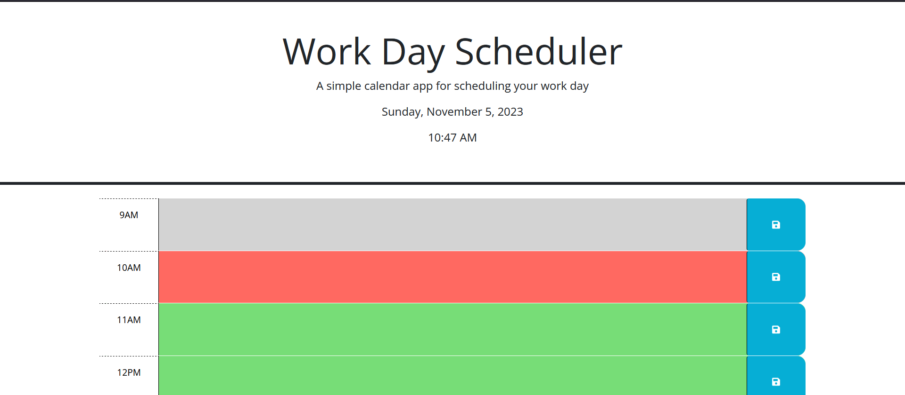
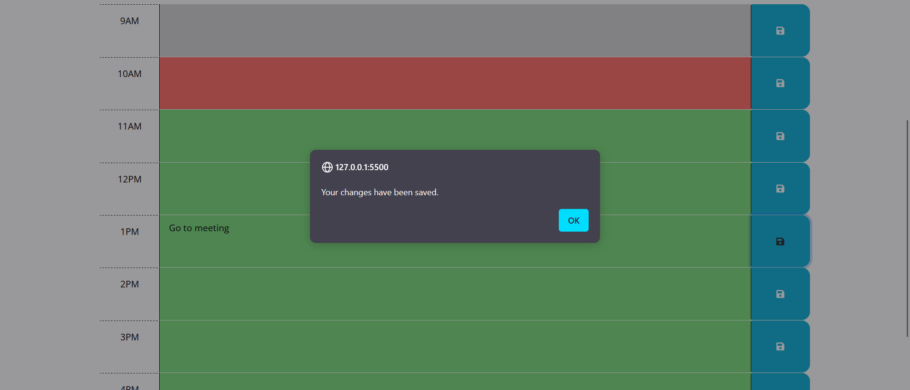

# Work Day Scheduler

## Description
Schedulers are a great way to keep your professional life organized. The typical work hours are 9AM to 5PM, which is always showcased in this project.

## Usage
This project was made using Javascript/jQuery, HTML, and CSS. One of the first things you notice when you load the webpage is that it shows the current time and day, this was used using the Day.js API. If you look into the source code in the HTML file you will notice that there is a div for each row and they have a class called `time-block`. Using this class we create a function this checks if the `time-block` associated with that row is the same hour as the current hour. If not, this is where CSS comes into play. If the `time-block` is less than the current hour, it will be gray as it is in the `past`, if it is the same as the current hour, it will be red as it is in the `present`, and lastly, if it is more than the current hour it will be green as it is in the `future`. One detail that is important for most websites, it being able to save your information regardless of it being reloaded. This was achieved using local storage.

## Images

## Link
Need to keep your work life organized? Click this [link](https://maxmruiz.github.io/work-day-scheduler/) to fix your work schedule.
